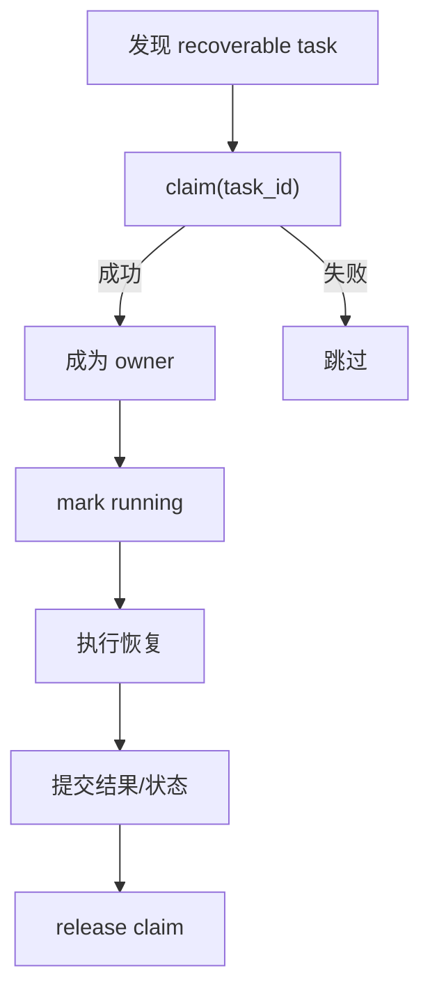
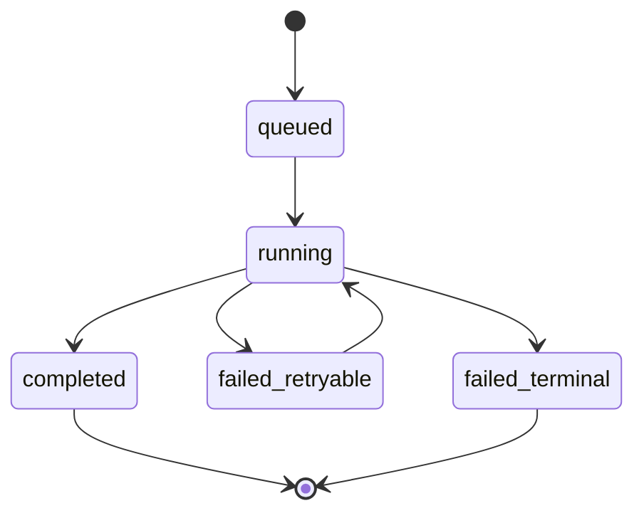
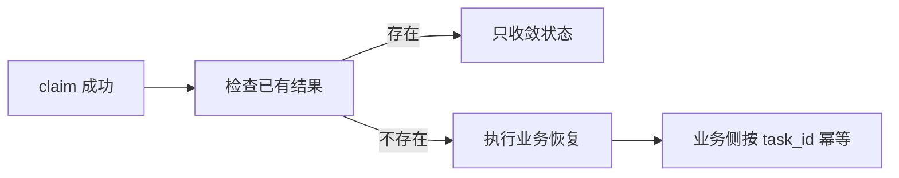
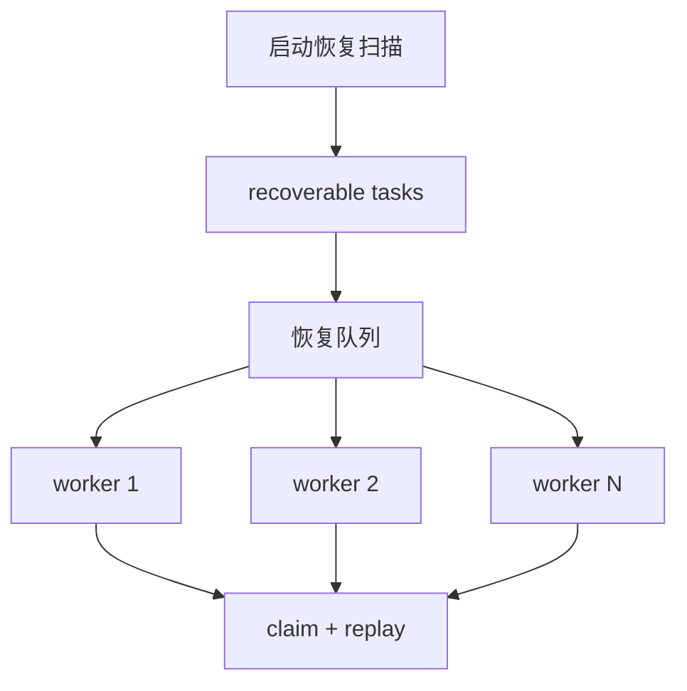
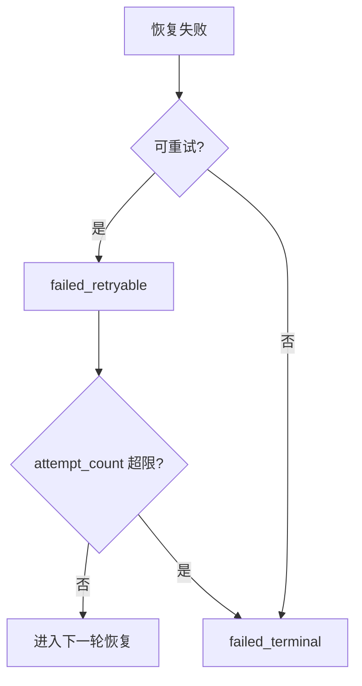
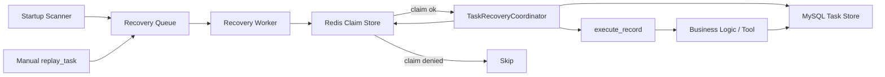

# 任务恢复问题分析与改造方案

## 文档信息
- 作者：Codex
- 版本：v1.0
- 更新日期：2026-06-29
- 状态：Draft

## 摘要
当前恢复链路已经具备较强基础：任务定义持久化、恢复状态持久化、启动恢复入口、可重放与不可重放区分都已存在。真正的短板不在“有没有恢复”，而在**多实例下谁有资格恢复、恢复过程中状态是否一致、恢复流量会不会伤害在线流量**。

这版方案按“问题 -> 风险 -> 解决方案”展开，聚焦任务恢复从“可用”提升到“更接近生产级”需要补的机制，不展开具体代码实现细节。

## 1. 缺少恢复执行权协调机制

### 当前问题
- 启动恢复会扫描 recoverable tasks 后直接发起 replay。
- 手动 `replay_task(task_id)` 也能独立触发恢复。
- 当前 `mark_task_running()` 是状态更新，不是恢复执行权裁决。
- 没有明确的 owner / claim / lease 语义。

### 风险
- 多实例同时启动时，同一任务可能被多个实例同时恢复。
- 自动恢复和手动恢复可能撞车。
- 运维无法明确回答“当前是谁在恢复这个任务”。

### 解决方案
引入**恢复执行权 claim 机制**，把“谁能恢复”从状态更新提升为独立控制动作。

方案设计：
- 每个待恢复任务在进入 replay 前，必须先申请 claim。
- claim 成功的实例才允许继续恢复。
- claim 失败的实例直接跳过，不更新失败状态。
- 自动恢复和手动恢复统一走同一套 claim 流程。
- claim 带 TTL，实例崩溃后由其他实例接管。

推荐实现：
- 用 Redis 存恢复 claim。
- key 形如 `task_recovery_claim:{task_id}`。
- value 至少包含：
  - `owner_instance_id`
  - `claimed_at`
  - `lease_expires_at`

配套规则：
- 每个实例启动时生成稳定 `instance_id`
- 长任务恢复期间需要续租
- 续租失败后，当前实例不能继续提交最终状态

## 2. 恢复状态一致性不足

### 当前问题
- 当前至少有两层状态：
  - task status
  - recovery execution_state
- 结果写入、任务完成、恢复完成是分步提交。
- 恢复判断容易只依赖其中一层状态。

### 风险
- 可能出现“结果已写，但任务仍是 working”。
- 可能出现“task 已 completed，但 recovery 仍是 running”。
- 下次恢复时系统可能误判任务仍需 replay。

### 解决方案
建立**明确恢复状态机**，并定义 task status 与 recovery state 的对应关系。

推荐 recovery state：
- `queued`
- `running`
- `completed`
- `failed_retryable`
- `failed_terminal`

推荐判断规则：
- `task.status = working` 且 `recovery.state in (queued, running, failed_retryable)`：允许进入恢复候选集
- `task.status = completed`：优先做状态收敛，不再重复执行业务
- `result_json` 已存在时：先判断是否只需补状态，不直接重跑

关键约束：
- `queued -> running -> completed`
- `queued/running -> failed_retryable`
- `queued/running -> failed_terminal`
- `completed` 和 `failed_terminal` 为终态

## 3. 缺少幂等恢复边界

### 当前问题
- 即使有 claim，也不能保证历史上绝对只执行一次。
- 崩溃可能发生在“业务副作用已完成，但状态还未提交”的窗口。

### 风险
- 重复 replay 仍可能发生，只是概率下降。
- 写下游表、发送事件、调用外部服务时可能产生重复副作用。

### 解决方案
把恢复系统职责和业务幂等职责拆开：

恢复系统负责：
- 同一时刻只有一个 owner 在恢复
- 尽量减少并发重复恢复

业务层负责：
- 同一恢复任务即使重复尝试，也不会重复产生副作用

具体设计：
- 对 replayable 工具，恢复时透传 `task_id`
- 将 `task_id` 作为恢复幂等键
- 写路径按 `task_id` 识别是否已执行过副作用
- 若已有最终结果，恢复流程优先做状态收敛，不再重做业务

## 4. 恢复风暴风险

### 当前问题
- 启动恢复当前更接近“扫描到就启动”。
- 恢复任务和前台任务没有明确资源隔离。

### 风险
- 服务重启后，大量任务同时恢复。
- 恢复流量打满 CPU、数据库、外部依赖。
- 在线请求会被恢复流量拖慢。

### 解决方案
把恢复执行改成**受控后台通道**。

方案设计：
- 恢复任务单独并发池
- 恢复任务单独限流
- 恢复扫描只负责“发现和入队”，不直接无界并发执行
- 恢复 worker 按固定并发消费
- 前台请求优先级高于恢复流量

推荐控制点：
- `max_recovery_concurrency`
- `recovery_rate_limit`
- `max_recovery_batch_size_per_scan`

推荐行为：
- 启动时批量恢复，不全量瞬时启动
- 手动 replay 也走同一后台恢复通道
- 多实例下仍依赖 claim 避免重复恢复同一任务

## 5. 失败处理不够分级

### 当前问题
- 当前失败处理偏“记失败”。
- 可重试和不可重试语义不够明确。
- 超过多次失败后的任务缺少明确出口。

### 风险
- 系统不知道哪些任务值得继续恢复。
- 某些任务可能无限失败、无限重试。
- 运维难以区分暂时失败和必须人工处理。

### 解决方案
把恢复失败分级，并增加自动恢复的停止条件。

推荐失败分级：
- `failed_retryable`
- `failed_terminal`

推荐规则：
- 网络抖动、瞬时依赖失败、超时：`failed_retryable`
- 参数错误、权限错误、不可 replay 工具：`failed_terminal`

配套策略：
- 使用现有 `attempt_count` 记录恢复次数
- 使用现有 `last_error` 记录最后错误
- 超过最大恢复次数后，自动转 `failed_terminal`
- `failed_terminal` 不再进入 recoverable 集合
- 运维聚焦 terminal failures 和高 attempt failures

## 6. 整体结构图

## 7. 改造顺序
1. 先补恢复 claim 机制
2. 再收紧恢复状态机
3. 再补恢复流量隔离
4. 再补幂等边界
5. 最后补失败分级和人工接管出口

## 8. 假设
- 当前 `mcp_task_recovery` 表结构继续沿用
- `attempt_count`、`last_error` 继续保留
- 多实例恢复协调优先使用 Redis claim
- 首版不实现任务取消和强制中断，只实现 owner 失联后的超时接管
- 首版接受“同一时刻一个 owner、历史上可能多次尝试”的恢复语义
